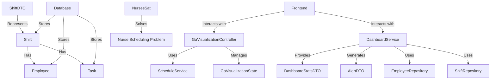

# Project Documentation: Roster Generator

## 1. Overview

This document provides an analysis of the Roster Generator web application. The application consists of a Java Spring Boot backend providing a REST API and serving a static frontend, interacting with a PostgreSQL database. Its primary function is to generate employee schedules (rosters) based on various inputs like tasks, employee availability, skills, and constraints.

## How to Run on new machine
*   **Prerequisites:**
    *   Java 17 to install java ```sudo apt install openjdk-17-jdk openjdk-17-jre``` 
    * ```java -version```
    *   Maven to install maven ```sudo apt install maven```
    * ``` mvn -v```
    *   PostgreSQL to install postgresql ```sudo apt install postgresql postgresql-contrib```
    * ```psql --version```
    *  run the following command to create a user and the database:
    *  ```sudo -u postgres psql```
    * ```CREATE DATABASE simpleroster-v2;```
    *  others useful commands:
    *  list databases: ```\l```
    * list users: ```\du```
    * connect to a database: ```\c simpleroster-v2```
    * insert the sql file ```\i data_refined.sql```
    * check the port that psql is running 
    * ```sudo netstat -nlpt | grep postgres```
    * or before stop the service psql and running psql:
    * ```sudo systemctl stop postgresql``` 
    * to change the port of psql to : 
    * ```sudo nvim /etc/postgresql/16/main/postgresql.conf```
    * change the port to 5433
    * ```sudo systemctl start postgresql```
    * before run the application:
    * set password for the postgres user:
    * Connect to the database: sudo -u postgres psql 
    * Enter the command: \password postgres
    * Enter the password on the application.properties file

    * import the jar file
* import the sql file

* to first populate the database:
* -u means username
* -d means database_name
* -a means all the output will be shown in the terminal
* -f means the file name
```bash
 psql -U postgres -d  -a -f data_refined.sql
 ```
*   **To run the application:**
* - Make sure PostgreSQL is running.
- Run the Spring Boot application using your IDE or command line:
```bash
mvn spring-boot:run
```
*   **To access the application:**
    *   Open a web browser and navigate to `http://localhost:8090/` for the main page.


## 2. Architecture

*   **Backend:** Java 17, Spring Boot 3.4.4, Maven
    *   **Framework:** Spring Boot (Web, Data JPA, Security, Actuator)
    *   **Database:** PostgreSQL
    *   **ORM:** Hibernate (via Spring Data JPA)
    *   **Authentication:** JWT (JSON Web Tokens) using `jjwt` library and Spring Security.
    *   **API:** RESTful API using Spring MVC controllers.
*   **Frontend:** Static HTML, CSS, JavaScript served directly by the Spring Boot application from the `src/main/resources/static` directory.
*   **Database Schema:** Defined by JPA entities (`Employee`, `Task`, `Skill`, `User`, `Shift`). Schema management currently relies on `spring.jpa.hibernate.ddl-auto=update`.

### Data Flow:

1.  User interacts with the frontend (HTML pages in the browser).
2.  Frontend JavaScript makes API calls to the Spring Boot backend (running on port 8090).
3.  `AuthController` handles login/registration requests, interacting with `AuthService`.
    *   `AuthService` uses `AuthenticationManager`, `PasswordEncoder`, and `UserRepository` for authentication/registration.
    *   On successful login, `JwtUtil` generates a JWT, which is sent back to the frontend.
4.  For subsequent authenticated requests, the frontend sends the JWT in the `Authorization` header.
5.  `JwtAuthenticationFilter` intercepts requests, validates the JWT using `JwtUtil` and `UserDetailsService`, and sets the security context.
6.  `ApiController` and `SkillController` handle other API requests (e.g., managing employees, tasks, skills, generating/viewing schedules, dashboard data).
7.  Controllers delegate business logic to corresponding Services (`EmployeeService`, `ScheduleService`, `TaskService`, `SkillService`, `DashboardService`).
8.  Services use Repositories (`EmployeeRepository`, `TaskRepository`, etc.) to interact with the PostgreSQL database via Spring Data JPA.
9.  Data is exchanged between layers using DTOs (Data Transfer Objects) like `EmployeeDTO`, `ShiftDTO`, `AuthRequestDTO`, etc.

### High-Level Architecture Diagram:



## 3. Components Status

### 3.1. Backend

*   **Core Framework (Spring Boot):** Ready. Setup seems standard and functional.
*   **Database Interaction (JPA/Hibernate):** Ready. Entities, Repositories are defined. Basic CRUD operations seem functional via Services.
*   **API Endpoints:** Ready. Controllers expose endpoints for authentication, employee management, task management, skill management, schedule generation/retrieval, and dashboard data. Error handling with HTTP status codes is implemented.
*   **Authentication & Authorization (Spring Security + JWT):** Ready. JWT generation, validation, and integration with Spring Security filters are in place. Endpoint security rules seem reasonably defined in `SecurityConfig`.
*   **Schedule Generation Logic (`ScheduleService`):** Partially Ready/Needs Review. This service exists and is connected but likely contains complex logic. Its effectiveness, performance, and correctness need thorough testing and potentially refinement. The exact algorithm used for scheduling is not detailed here.
*   **Data Seeding (`data_refined.sql`):** Ready. Provides initial data for the database.
*   **Configuration (`application.properties`):** Ready, but requires security improvements (see section 4).

### 3.2. Frontend

*   **HTML Pages:** Ready (`index.html`, `login.html`, `dashboard.html`, `roster.html`). Basic structure exists.
*   **JavaScript:** Partially Ready/Needs Review. JavaScript files exist (`static/js/`) to handle API interactions and UI updates. The completeness and robustness of the frontend logic (API calls, data display, user interaction, error handling) need verification.
*   **CSS/Styling:** Unknown. Assumed to be present but not explicitly analyzed. Quality and completeness need review.

### 3.3. Database

*   **Schema:** Ready (based on Entities).
*   **Data:** Initial data provided via `data_refined.sql`.

*   **PostgreSQL:** Assumed to be installed and running. The database connection is configured in `application.properties`.
*  **To create the database:**
* - Create a database named `simpleroster-v2` in PostgreSQL.

* **to first populate the database:**
* -u means username 
* -d means database_name 
* -a means all the output will be shown in the terminal
* -f means the file name 

## 4. Areas for Improvement / To-Do

*   **Security:**
    *   **Hardcoded Secrets:** **CRITICAL.** The JWT secret key in `JwtUtil.java` and the database password in `application.properties` are hardcoded. These *must* be externalized and managed securely (e.g., environment variables, Docker secrets, HashiCorp Vault, Spring Cloud Config Server).
    *   **CORS Configuration:** The current `@CrossOrigin` usage is permissive. For production, configure CORS globally (e.g., in `SecurityConfig` or a `WebMvcConfigurer` bean) to restrict allowed origins, methods, and headers precisely.
    *   **Password Policy:** Implement password strength validation during registration (`AuthService`).
    *   **Error Handling:** Ensure sensitive information is not leaked in error responses sent to the client. Log detailed errors server-side.
*   **Database:**
    *   **Schema Management:** Replace `spring.jpa.hibernate.ddl-auto=update` with `validate` or `none` for production. Use a database migration tool like Flyway or Liquibase for reliable schema evolution.
    *   **Data Modelling (`Employee` entity):** Storing complex data like `availability` and `preferences` as simple Strings is brittle. Consider using dedicated tables or leveraging PostgreSQL's JSONB type for better structure and querying capabilities.
    *   **Indexing:** Review database query performance, especially for `ScheduleService`, and add appropriate indexes to tables as needed.
*   **Schedule Generation (`ScheduleService`):**
    *   **Algorithm Review:** Thoroughly review and test the scheduling algorithm for correctness, fairness, constraint satisfaction, and performance.
    *   **Optimization:** If performance becomes an issue with larger datasets, profile and optimize the scheduling logic. Consider asynchronous execution for long-running generation tasks.
    *   **Error Handling:** Improve error handling within the generation process to provide meaningful feedback if a valid schedule cannot be created.
*   **Frontend:**
    *   **UI/UX:** Review and enhance the user interface and user experience.
    *   **Error Handling:** Implement robust error handling for API calls and display user-friendly messages.
    *   **State Management:** Depending on complexity, consider a simple state management approach if needed.
    *   **Build Process:** For larger frontends, consider using a modern build tool (like Vite, Webpack) and framework/library (like React, Vue, Angular) instead of plain static files, although the current approach might be sufficient.
*   **Dependencies:**
    *   **Spring Security Versions:** Remove the explicit `<version>` tags for `spring-security-*` dependencies in `pom.xml` to let the `spring-boot-starter-parent` manage compatible versions, reducing potential conflicts.
*   **Testing:**
    *   **Unit Tests:** Add comprehensive unit tests for services (especially `ScheduleService`), controllers, and utility classes.
    *   **Integration Tests:** Implement integration tests covering API endpoints and interactions with the database.
    *   **End-to-End Tests:** Consider E2E tests to verify the complete user flow.
*   **Deployment:**
    *   **Containerization:** Consider Dockerizing the application for easier deployment and environment consistency.
    *   **CI/CD:** Implement a CI/CD pipeline for automated building, testing, and deployment.
*   **Logging:** While logging exists (especially in security filters), ensure consistent and structured logging across the application for easier monitoring and debugging. Configure log levels appropriately for different environments.

## 5. Conclusion

The Roster Generator application has a solid foundation based on Spring Boot and standard practices. The backend structure is logical, and core features like authentication and basic CRUD operations are implemented. The main areas requiring attention are security hardening (removing hardcoded secrets), refining the potentially complex `ScheduleService` logic, improving database schema management and data modeling for flexibility, and thoroughly testing the entire application. The frontend needs verification for completeness and user experience. Addressing the points in Section 4 will significantly improve the application's robustness, security, and maintainability.